1.  在虚拟机中配置数据库

    1.  登入创建的PSQL-DB数据库虚拟机

    2.  运行 `sudo apt update && sudo apt upgrade -y`

    3.  运行 `sudo apt install postgresql postgresql-contrib -y`

    4.  运行 `psql –version`, 查看版本号

        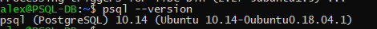

    5.  开放PostgreSQL连接白名单(非生产环境)

        运行 `sudo vi /etc/postgresql/10/main/pg_hba.conf`，
        添加 host/all/all/0.0.0.0/md5至IPV4 local connection下，如图：

        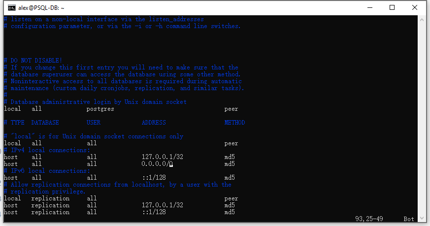

        运行 `sudo vi /etc/postgresql/10/main/postgresql.conf`，
        取消listen_addresses前的注释符，并将localhost修改为\*，如下图：

        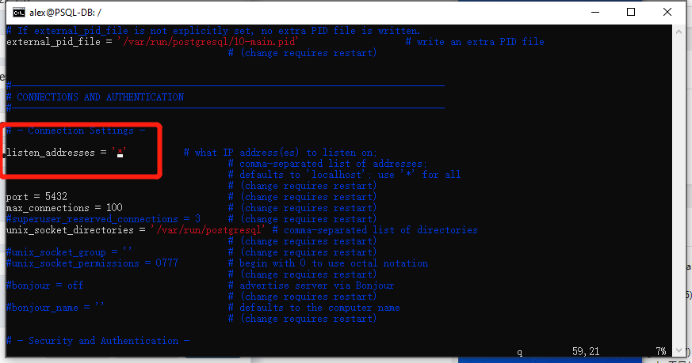

        修改方式:

        -   定位到对应行

        -   按键盘i键，底部出现INSERT

        -   输入对应内容

        -   按ESC，底部INSERT消失，输入 “:wq!”,自动保存退出

        修改完成后运行 sudo systemctl restart postgresql 重启数据库服务

        修改postgres用户密码为postgres

        -   输入 `sudo su postgres`

        -   输入 `psql`

        -   输入 `ALTER USER postgres WITH PASSWORD 'postgres';`

    1.  开放虚拟机防火墙5432端口以便外网访问数据库，如图

        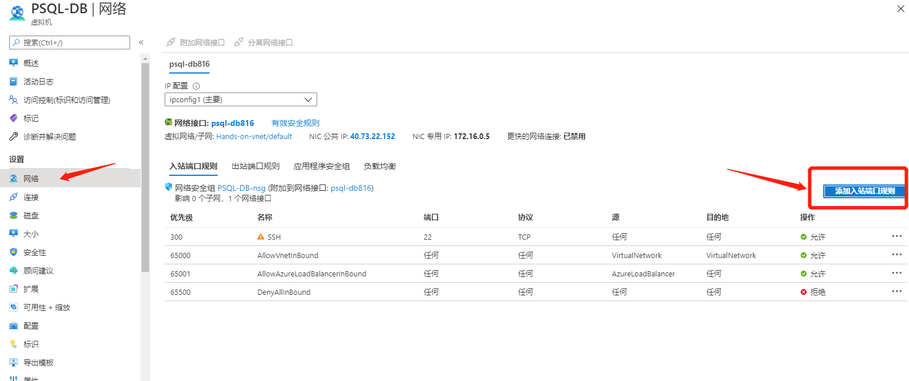

        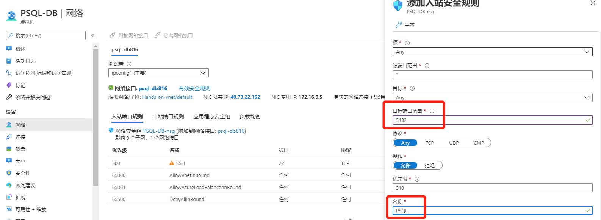

    2.  运行PGAdmin，连接数据库服务器，创建新的数据库iotdata,并在数据中iotdata-Schemas-Tables中新建表aiot，如下图：

        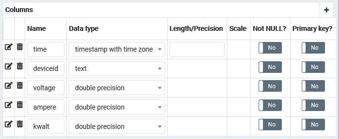

1.  在VScode中创建Function函数

    使用Ctrl+Shift+P组合键打开命令面板，输入functions， 选择create function –
    Javascript –Azure Event Hub trigger– 输入期望的函数名称 – Create New local
    app setting – 选择建立的eventhub 名称 – 选择建立的事件中心实体名称 –
    RootManageedSharedAccessKey - \$Default

    左侧点击 index.js,
    按F5触发函数调试，同时运行设备模拟器，查看日志输出。如弹出需要选择存储账户，则选择Select
    Storage Account, 然后点击Create new storage account 即可

    运行成功日志输出如下图：

    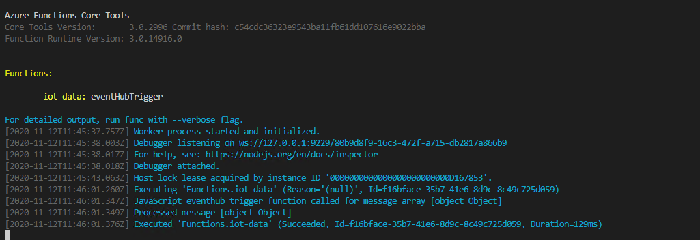

2.  在VScode中运行 npm install pg, 并将“IoT Hands On\\IoT_Hands-on_Lab\\Session
    1\\Azure_Function_App” 中index.js 中内容全部复制至新建函数的index.js
    中并覆盖。

    根据实际情况修改框中内容，如图：

    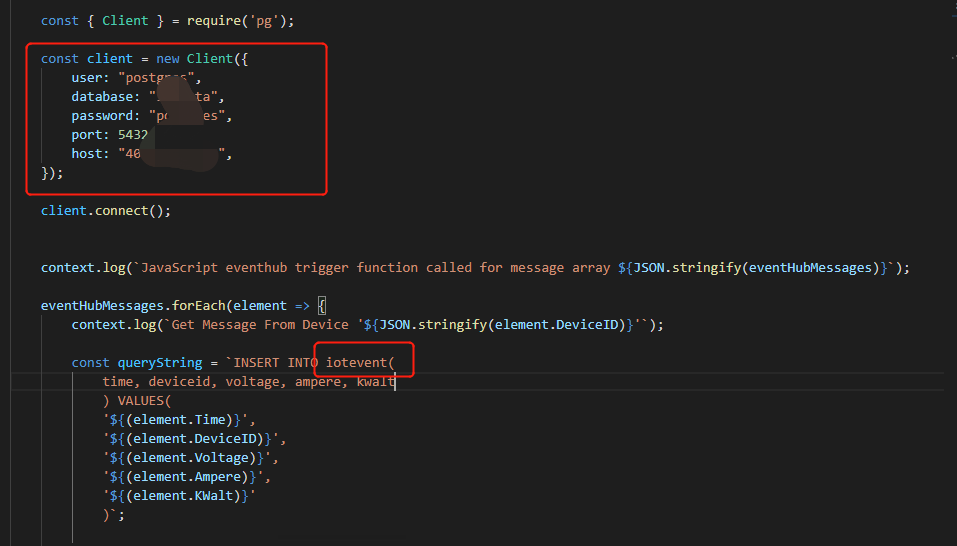

3.  本地按F5开启调试，并开启模拟器，如图所示log即为成功：

    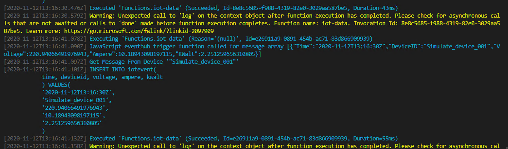

    进入PGAdmin 可以看到数据已经写入数据库

    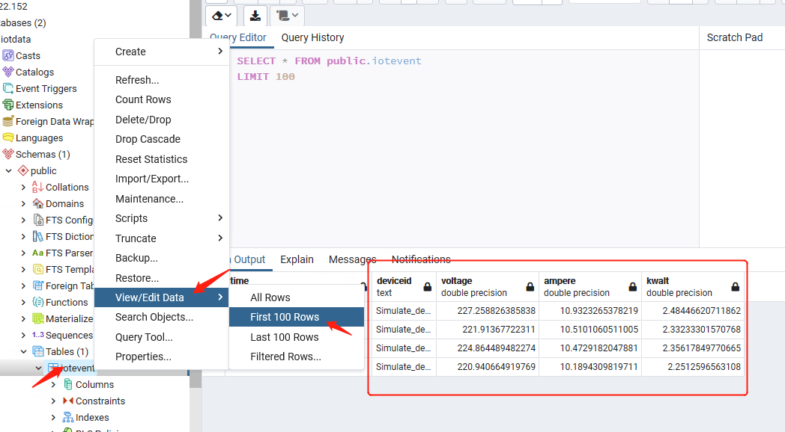

4.  最后，将本地开发完成的函数部署至云端，如图：

    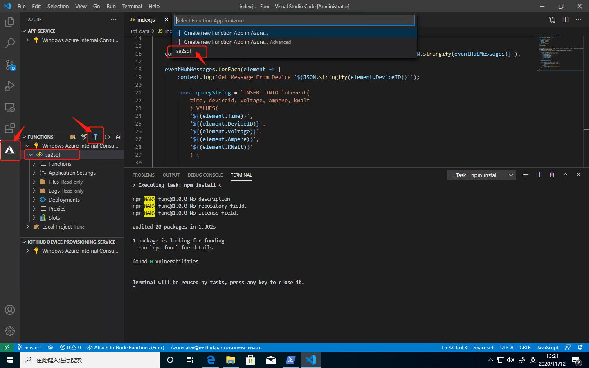

    可以从log观察部署过程

    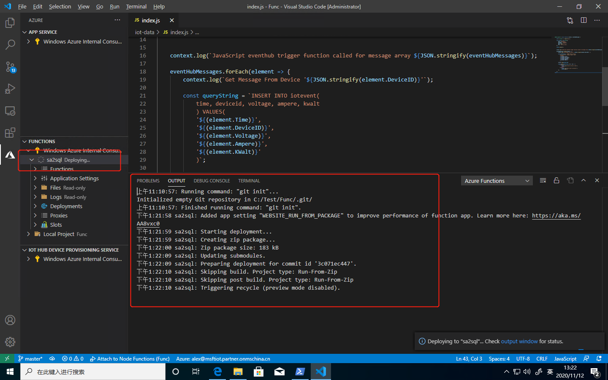

    切记，在上传完成后还需要点击upload config。

    同时，我们可以在Azure控制台
    函数-iot-data-监视-日志，看到成功执行的日志和报警。
