1.  创建设备预配服务注册

    进入创建的设备预配服务iothub-dps-001, 设置-管理注册-添加注册组

    1.  组名：dps001

    2.  证明类型：对称密钥

    3.  链接新的IoT中心：iothub-001

    4.  初始设备孪生状态，修改为：

        ```json
        {
        "tags": {
            "device_type":"Simulated"
            },
            "properties": {
                "desired": {
                    "Telemetry_Interval":5,
                    "Send_Data":true
                    }
            }
        }
        ```
        
   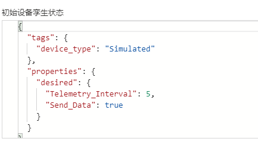

创建成功后，记下三个信息：

-   点击刚刚建立的dps001注册组，记录对称密钥-主键

    

-   回到iothub-dps-001主页，点击左侧概述，记录全局设备终结点和ID范围

    

1.  将Github对应代码克隆至本地

    打开Powershell，运行

    1.  `mkdir "IoT Hands On"`

    2.  `cd '.\\IoT Hands On\\'`

    3.  `git clone <https://github.com/pczhao1210/IoT_Hands-on_Lab.git>`

        打开电脑-C盘-用户-{用户名}-IoT Hands On-IoT_Hands-on_Lab, 确认文件夹存在

2.  使用VScode运行代码

    打开VScode，安装插件， 如图

    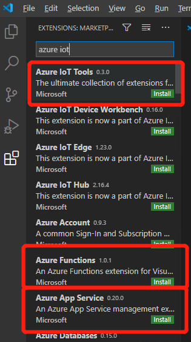

    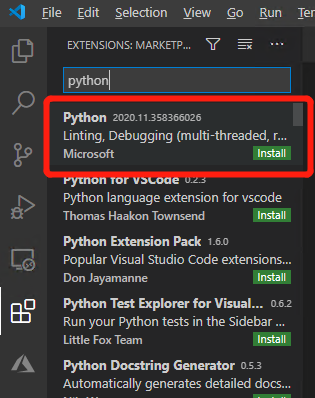

    安装完成后，使用键盘组合键Ctrl+Shift+P, 打开命令栏，输入Sign in, 选择Sign in
    to Azure Cloud – Azure China, 使用凭据登录在打开的浏览器中登录账户。

    VScode使用Ctrl+O组合键，选择C盘-用户-{用户名}-IoT Hands
    On-IoT_Hands-on_Lab-Session 1-Device_Simulator_Python，打开

    修改demo_device_full_function.py 文件的第16-19行：

-   Provisioning_host设置为设备预配服务的全局设备终结点

-   Registration_id设置为自定义的设备名称

-   Id_scope设置为设备预配服务的ID范围

-   Symmetric_key设置为dps001注册组证明密钥主键

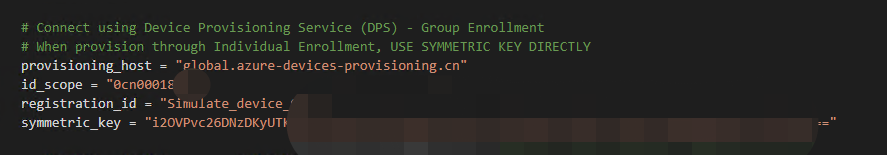

Ctrl+S保存文件并点击右上角运行按钮。

查看输入日志，设备预配已经成功，并且间隔5秒向IoT Hub发送数据。

1.  使用时序见解服务分析设备发送至云的数据

    1.  选择配置的设备名称，勾选Ampere, Voltage, Walt, 点击添加，如图

        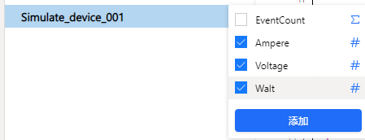

        

    2.  为设备配置模型及物理层次结构

        1.  点击左侧模型按钮

            

        2.  如图添加层次结构字段

            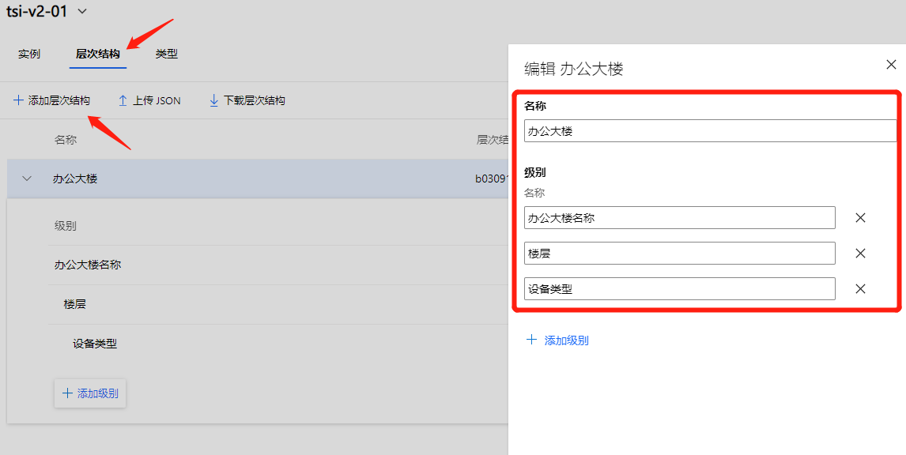

        3.  如图添加实例字段

            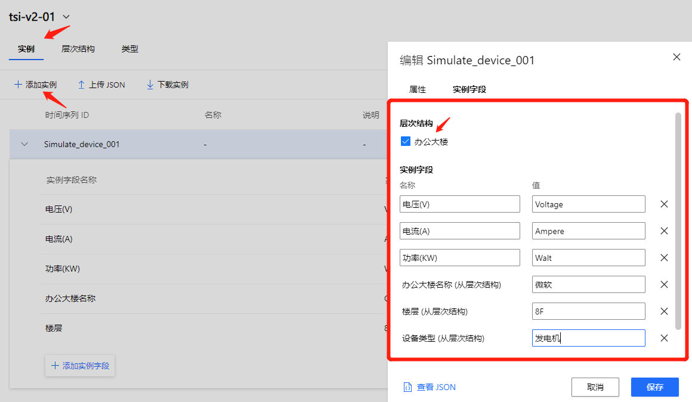

        4.  如图添加类型字段

            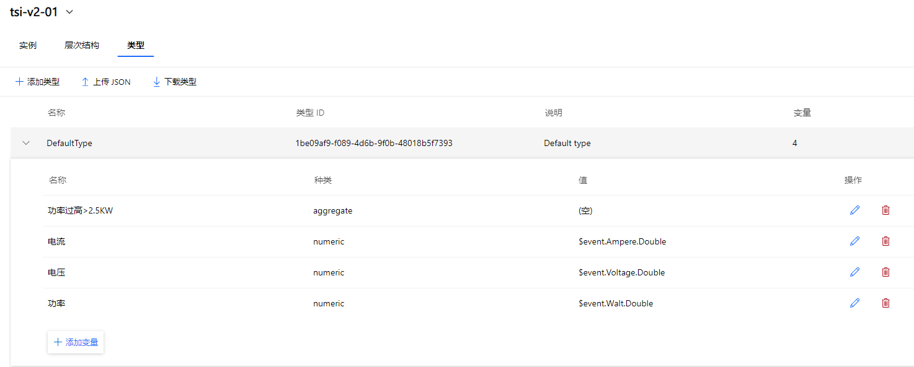

            除正常电流电压功率外，添加功率过高字段，如下图

            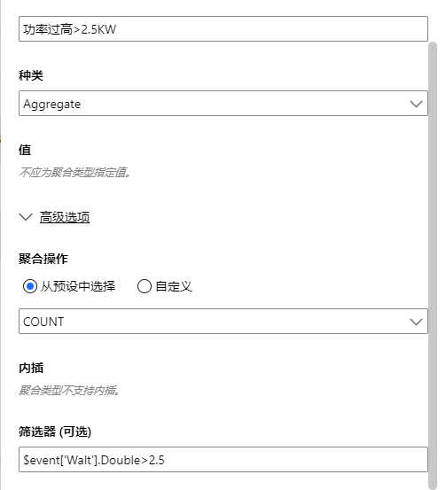

            通过如上配置，我们可以看到数据的情况并针对异常数据进行分析

            最终配置完成如下图

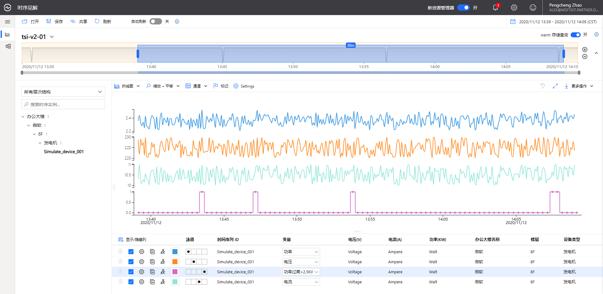

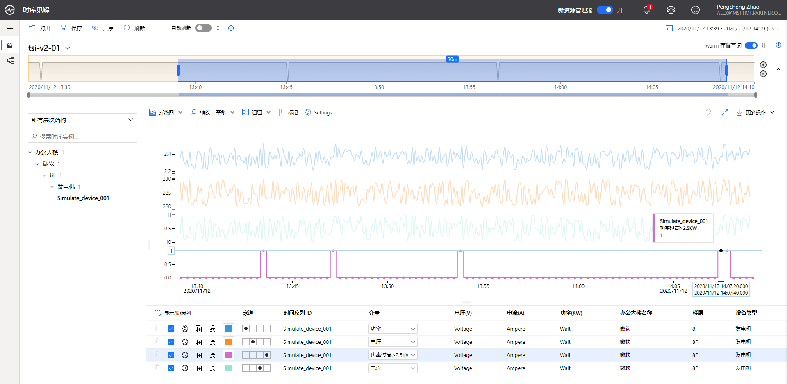
