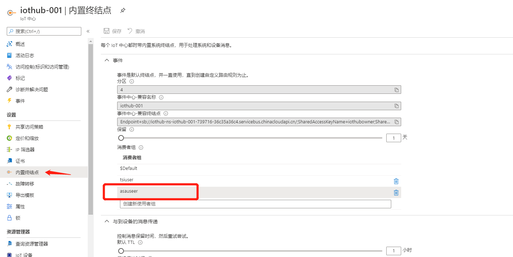
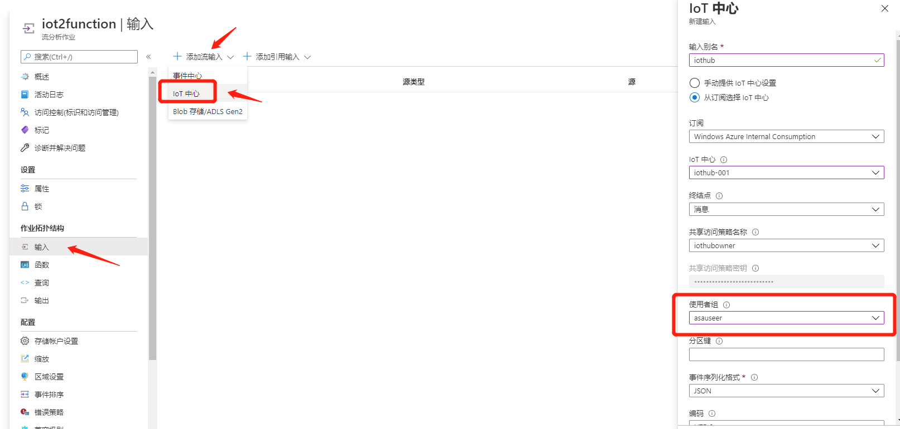
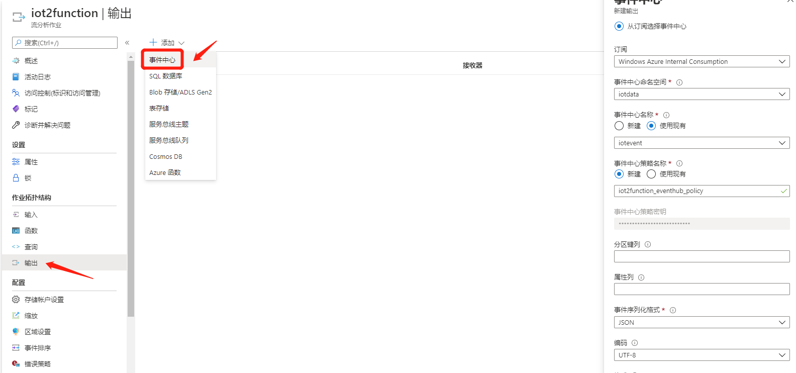
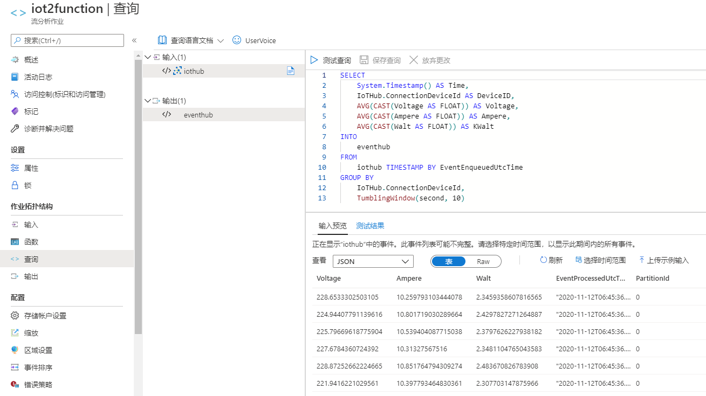

>   本节主要聚焦在数据预处理，因为目前Azure Stream Analytics
>   流分析作业暂时只支持将结果输出至事件中心，SQL数据库，Blob存储，表存储，服务总线，Cosmos
>   DB (SQL API)和应用服务，所以如果期望将数据写入除Azure SQL和Cosmos
>   DB之外的数据库，最佳方式是使用Function配合消息队列进行触发。

1.  在IoT Hub中新建内置终结点消费者组asauser，如下图

    

2.  配置流分析作业的输入输出

-   选择作业拓扑结构-输入，选择IoT中心，输入别名，使用刚刚创建的消费者组asauser，如下图

    

-   选择作业拓扑结构-输出，选择事件中心，输入别名，如下图

    

1.  配置查询语句并测试

-   进入查询，如IoT_Hands-on_Lab\\Session
    1\\Azure_Stream_Analytics中配置查询语句，并测试，如下图

    

1.  运行流分析作业
