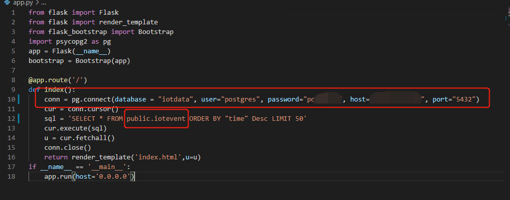
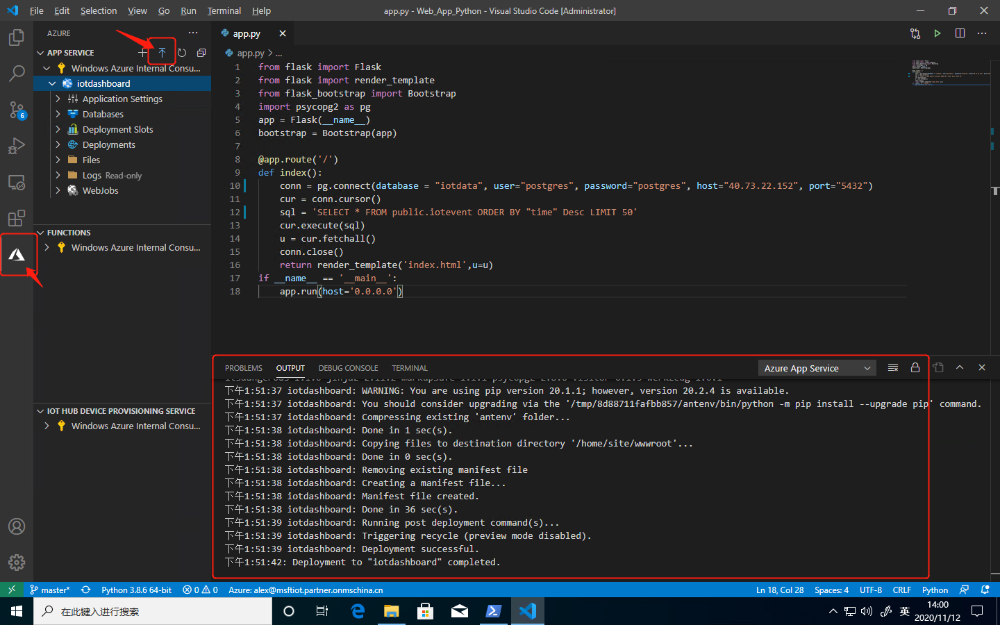
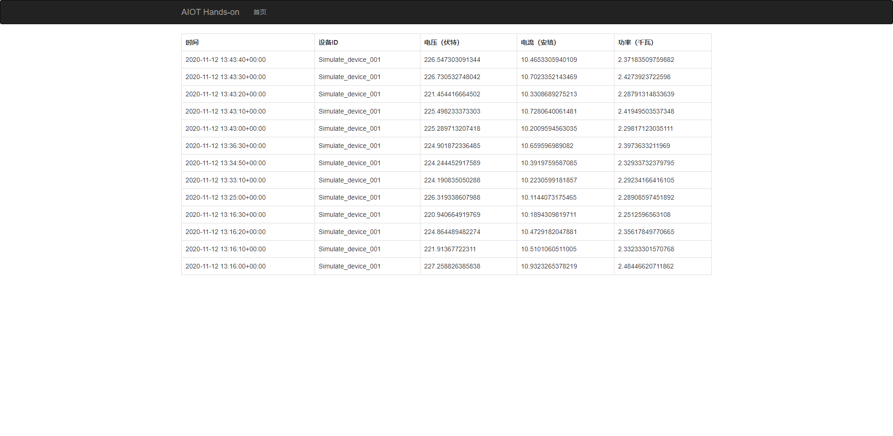

1.  利用VScode打开Python Web App文件夹

2.  打开app.py,按照情况进行连接信息的修改，如图：

    

3.  将APP部署至Azure，如图：

    

    通过日志可以查看进度。

4.  跳转至Azure首页，打开建立的iotdashboard应用服务，如图所示可以找到应用URL，点击URL。如部署已经成功，则可以看到来自于设备的数据已经显示在网页上。

    
