1.  连接创建的虚拟机Edgee-Device, 进行Edge 运行环境部署

    1.  打开命令行工具，使用 ssh username\@serverip 登录服务器

    2.  运行 sudo apt update && sudo apt upgrade -y

    3.  运行 curl
        https://packages.microsoft.com/config/ubuntu/18.04/multiarch/prod.list
        \> ./microsoft-prod.list

    4.  运行 sudo cp ./microsoft-prod.list /etc/apt/sources.list.d/

    5.  运行 curl https://packages.microsoft.com/keys/microsoft.asc \| gpg
        --dearmor \> microsoft.gpg

    6.  运行 sudo cp ./microsoft.gpg /etc/apt/trusted.gpg.d/

    7.  运行 sudo apt updatee

    8.  运行 sudo apt-get install moby-engine

    9.  运行 sudo apt-get install iotedge

    10. 运行 sudo systemctl status iotedge,
        确认服务已安装，因为暂时未配置连接，所以服务运行失败，如下图：

        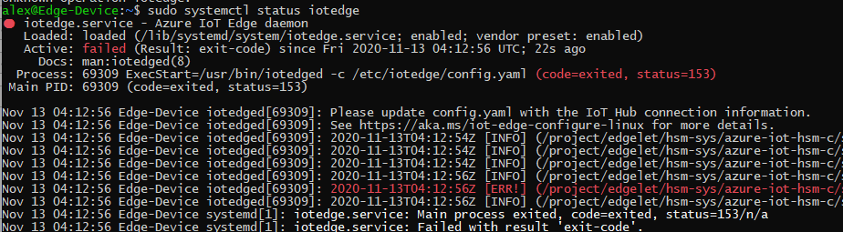

2.  配置IoT Edge使其连接至IoT Hub

    1.  登入Azure Portal – IoT Hub – iothub-001

    2.  选择自动设备管理-IoT Edge-添加IoT Edge 设备

    3.  设备ID定义为： edge-device-001, 点击保存

    4.  点击刚刚创建的设备 edge-device-001, 记录主连接字符串

    5.  Edge-Device 虚拟机命令行运行 sudo vi /etc/iotedge/config.yaml

    6.  修改88行的devicee_connection_string后的值为刚刚记录的额edge-device-001的连接字符串

        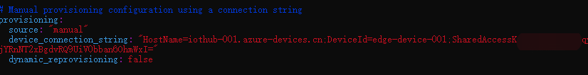

    7.  确认无误后，按下ESC – 输入:wq! 退出编辑

    8.  运行 sudo systemctl restart iotedge

    9.  运行 sudo systemctl status iotedge, 观察服务是否运行正常，如下图

        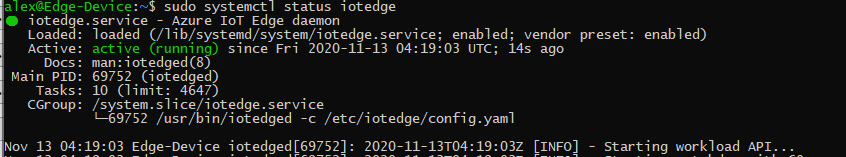

        可以看到状态已经变成Active的运行状态

        回到Azure Portal，我们也可以看到设备的IoT Edge运行时响应变成了417 --
        未设置设备的部署配置，这也是正常状态，因为我们还没有进行模块的部署。

        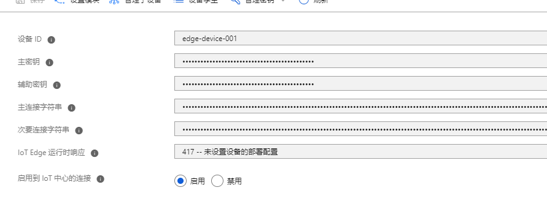

3.  使用Azure Portal进行实例模块的部署

    1.  在Azure Portal的设备管理页面，点击设置模块，如图：

        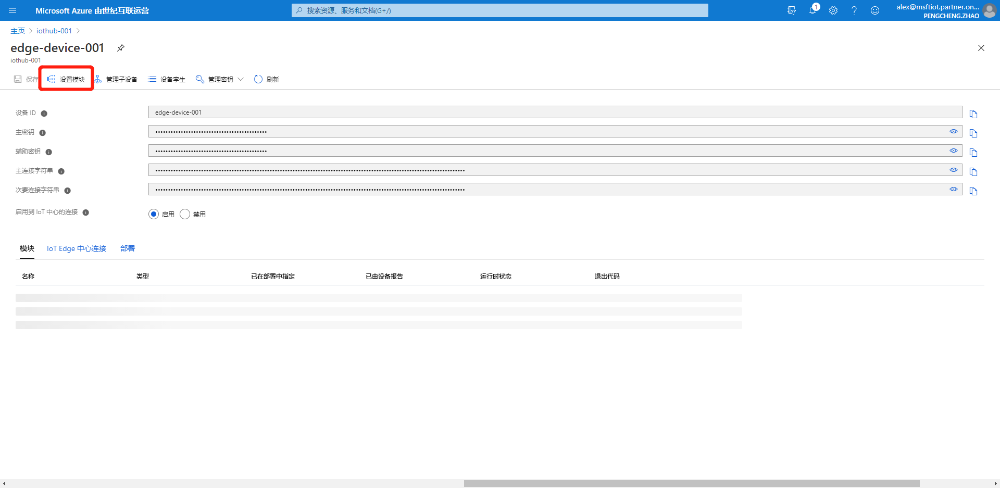

    2.  在设置模块中，点击Add – IoT Edge Module,

        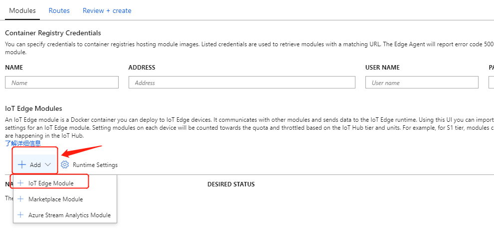

        在弹出的框中:

        Module Settings 选项卡：

-   IoT Edge Module Name: tempsensor

-   Image URI: mcr.microsoft.com/azureiotedge-simulated-temperature-sensor:1.0

    Module Twin Settings 选项卡：

    {

    "SendData": true,

    "SendInterval": 5

    }

    最后点击Add保存。

    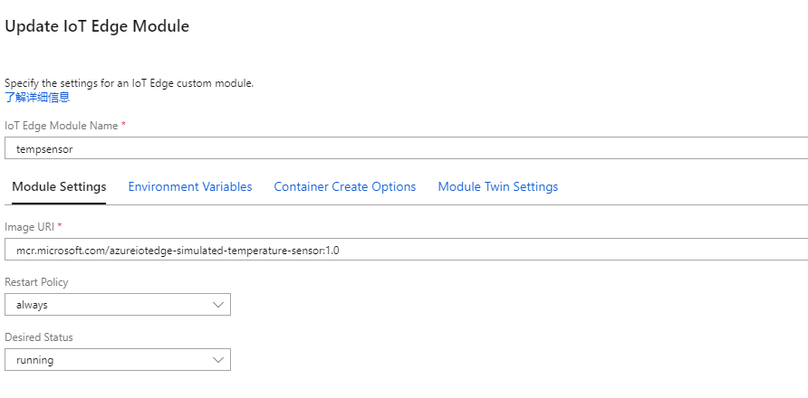

    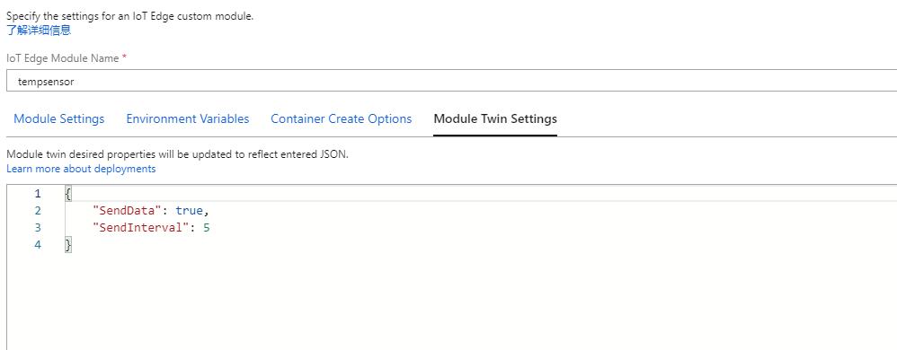

    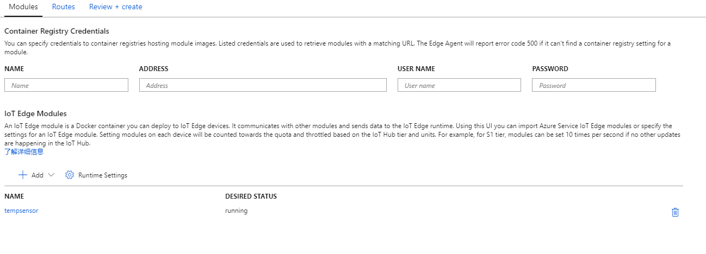

    1.  点击下方蓝色按钮，Review + Create, 再点击Create。

        等待约1分钟，刷新界面，可以看到已经部署成功。

        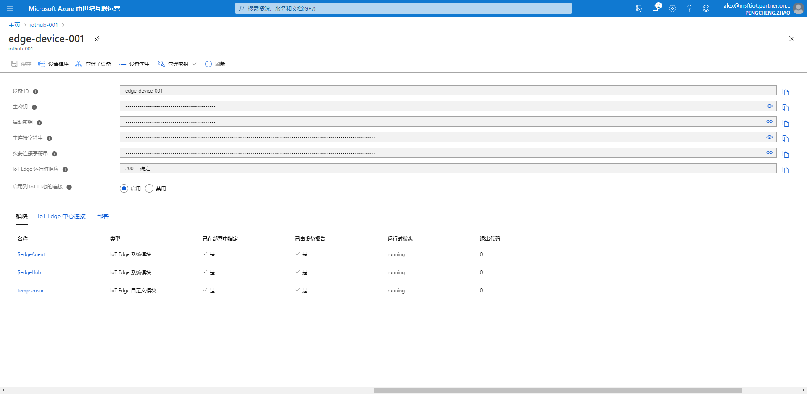

1.  使用时序见解检查消息是否成功到达IoT Hub

    1.  打开Azure Portal中的时序见解，查看实例的原始事件。

        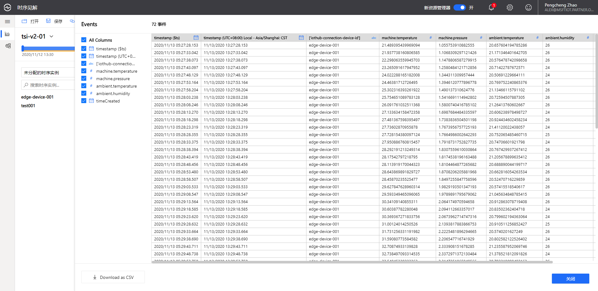
