>   本实验会开发一个IoT
>   Edge模块并部署至边缘设备，这个模块会将原始tempsensor的数据进行本地预处理，将处理完成的值发送至IoT
>   Hub。类似的场景有本地的数据清洗，数据去重，数据加密等等。

1.  在VSCode中新建IoT Edge模块

-   在VSCode中通过Ctrl+Shift+P组合键打开命令窗，输入Edge，选择Azure IoT Edge:
    New IoT Edge Solution

    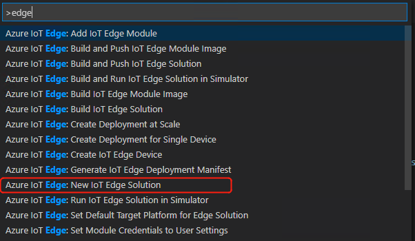

-   选择本地开发文件夹，输入解决方案名称（不是模块名称），选择模块开发语言（python），输入名称edgeoffset，
    将localhost:5000替换为Azure Portal中创建的Azure 容器注册表地址（如图）

    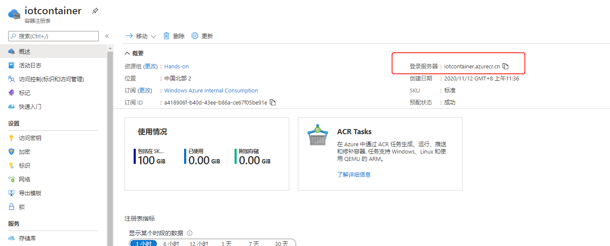

    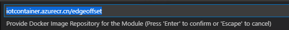

-   依次展开modules\\edgeoffset\\main.py，并使用\\IoT Hands
    On\\IoT_Hands-on_Lab\\Session
    2\\Edge_Offset_Python\\modules\\Edge_Offset\\main.py 的内容进行替换。

-   在.env文件中，将CONTAINER_REGISTRY_USERNAME_iotcontainer和CONTAINER_REGISTRY_PASSWORD_iotcontainer分别如图进行设置：

    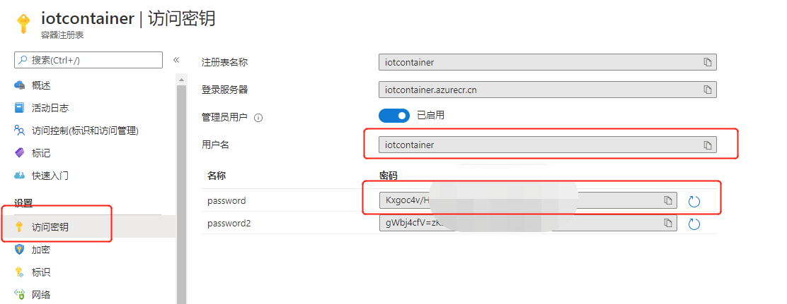

-   打开deployment.template.json文件，并使用\\IoT Hands
    On\\IoT_Hands-on_Lab\\Session
    2\\Edge_Offset_Python\\deployment.template.json文件中的内容进行替换。

2.  将IoT Edge模块部署至Edge Device

-   邮件单机deployment.template.json，首先使用命令行登录Azure 容器注册表，

    ```docker login {youracrname}.azurecr.cn```如图:

    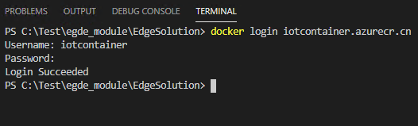

    之后选择Build and Push IoT Edge Solution, 如图

    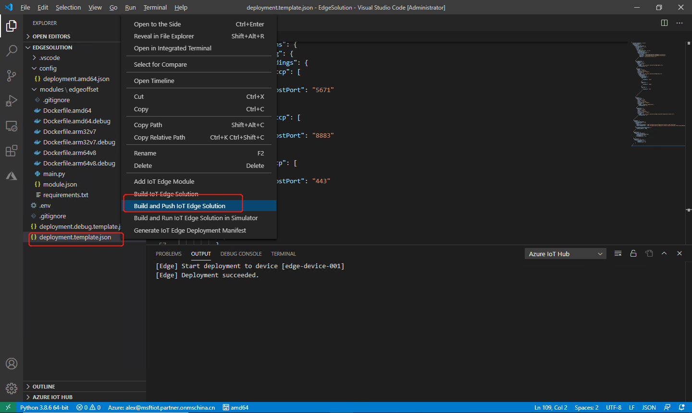

    等待推送成功后，我们可以在Azure 容器注册表存储库看见对应镜像

    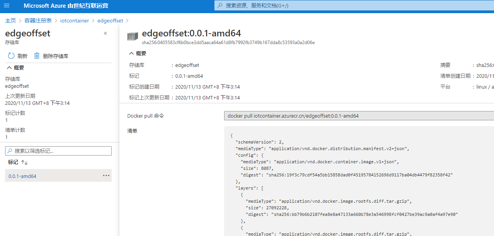

-   等待上步操作完成后，右键单击deployment.template.json, 选择generate IoT Edge
    Deployment Manifest,如图

    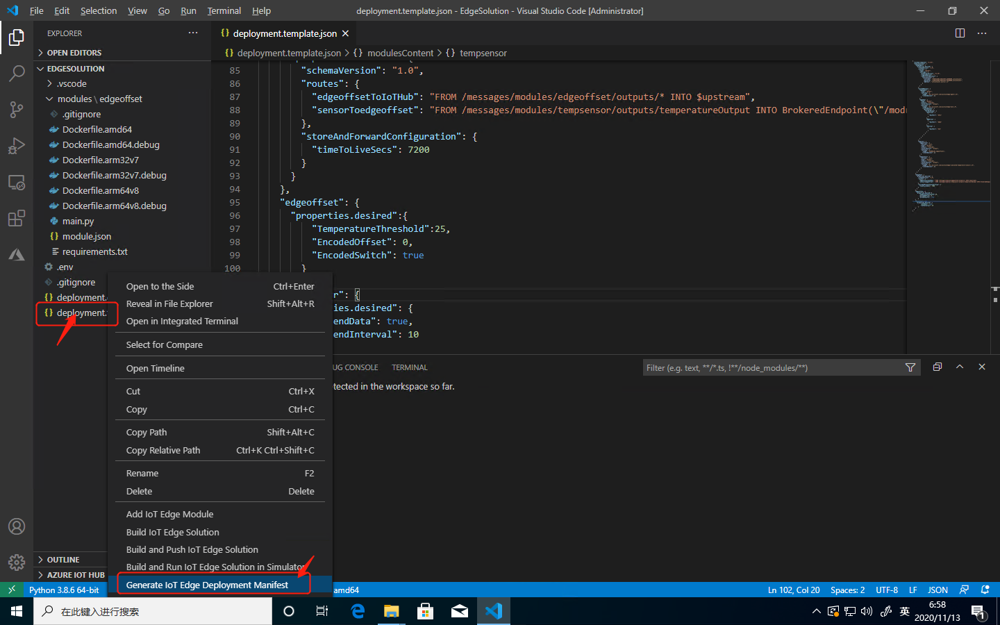

    项目文件夹中会出现config文件夹，展开后可以看见部署文件deployment.amd64.json

    如果需要为树莓派/Jeston等设备部署，需要在下边栏中讲CPU架构进行对应更改，如图：

    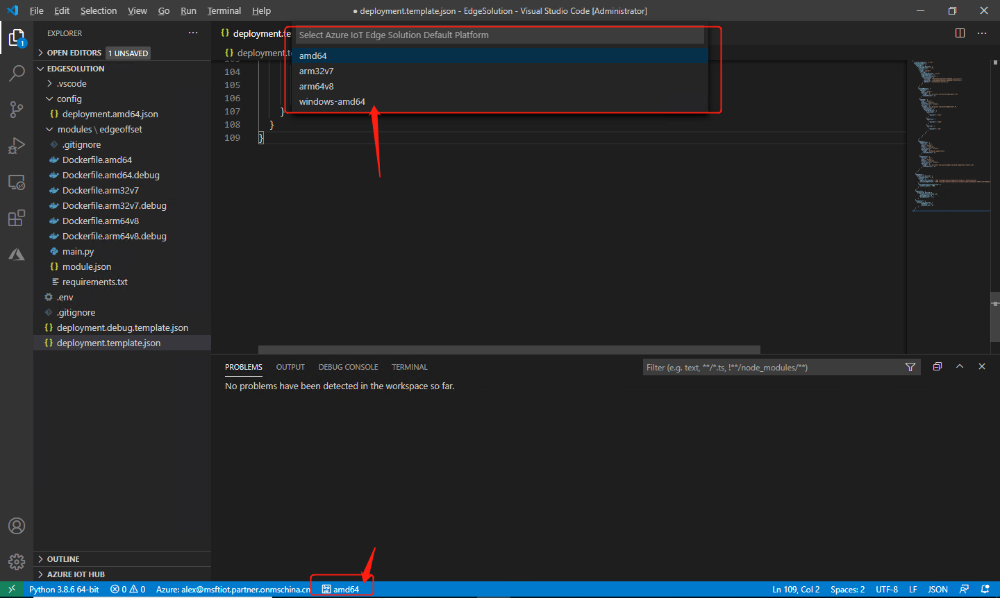

-   在生成的部署文件上点击右键，选择Create Deployment for Single Device

    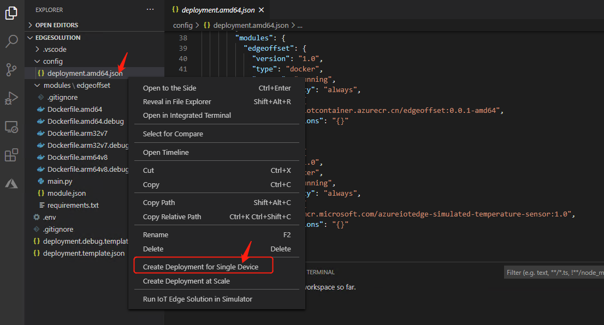

    并选择我们创建的Edge设备

    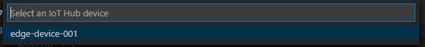

    等待约1分钟后，在Edge Device虚拟机中运行 sudo iotedge list,
    可以看见模块已经部署成功

    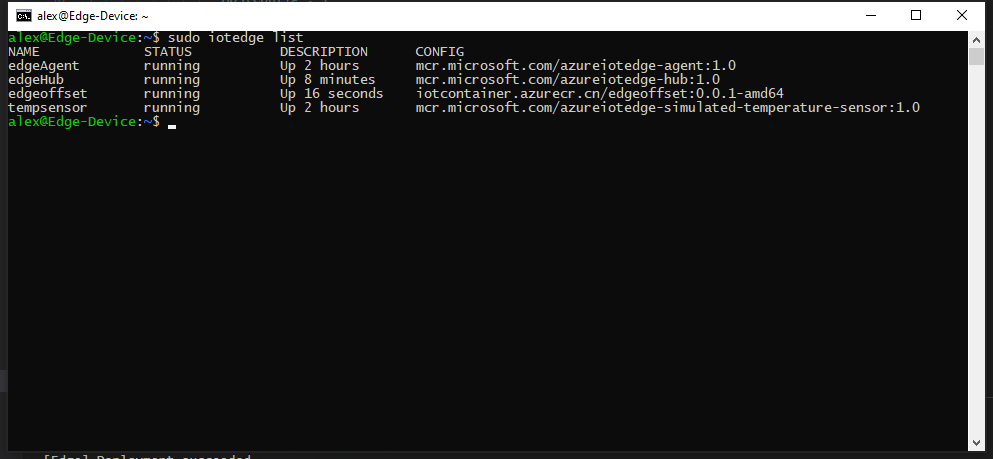

3.  设置Module Twin

-   进入VSCode, 依次展开Azure IOT HUB, edge-device-001, Modules

-   选择需要调整Twin的模块，右键点击edgeoffset，选择Edit Module Twin

    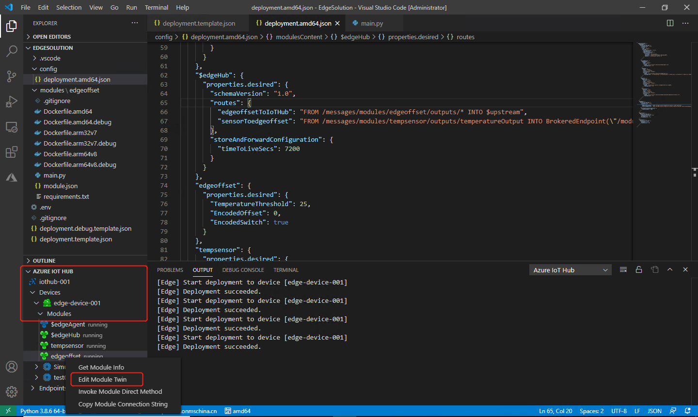

    查看这孪生Desired属性

    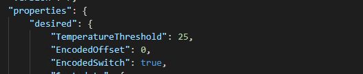

    其中，

-   TemperatureThreshold：为温度阈值，消息中machine温度大于设定值TEMPERATURE_THRESHOLD设定值时,
    为消息添加Alert属性，输出到output1通路

-   EncodedOffset: 为所有的温度设置偏移量ENCODED_OFFSET，输出到output2通路

-   EncodedSwitch:
    为偏移量功能设置开关，如为false则不会对温度进行处理，output2通路将没有数据

-   设置Twin的值，将TemperatureThreshold
    设置为30，EncodedOffset设置为-10，EncodedSwitch设置为true，修改完成后右键选择Update
    Module Twin，如图

    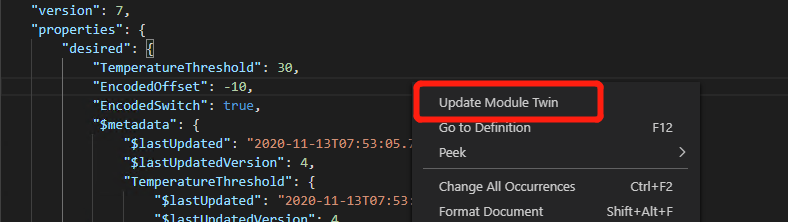

4.  使用Azure IoT Explorer查看发送至IoT的消息

    -   打开Azure Portal, 记录IoT Hub - iothubowner身份的连接字符串

    -   打开Azure IoT Explorer, 输入复制的连接字符串

        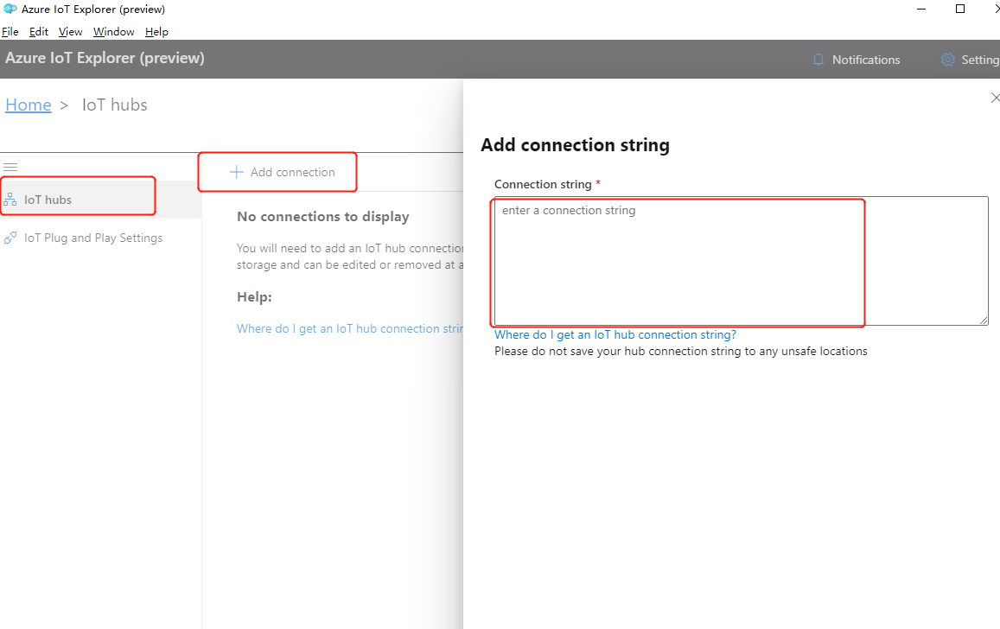

        在设备列表中选择我们的Edge 设备，edge-device-001

        

        选择Telemetry，Start

        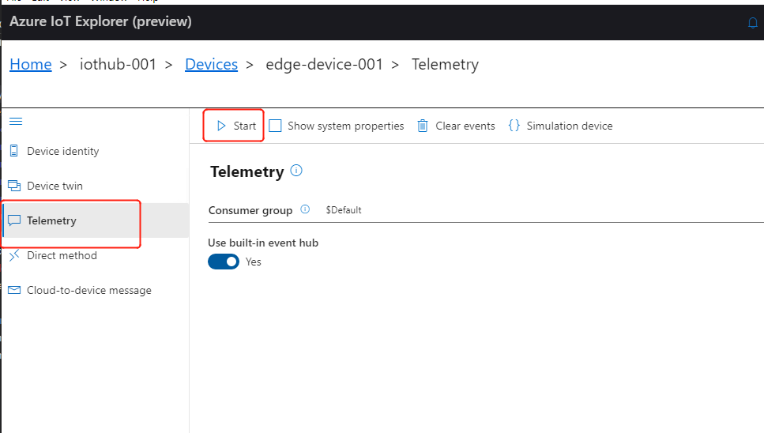

        查看收到的消息：

        第一条为处理过的消息：

        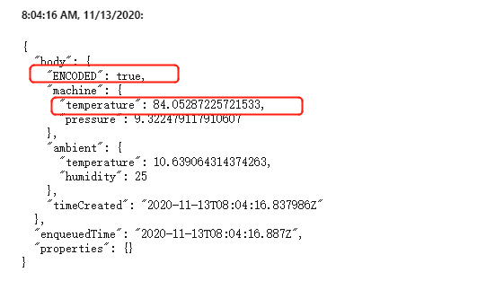

        第二条为原始消息：

        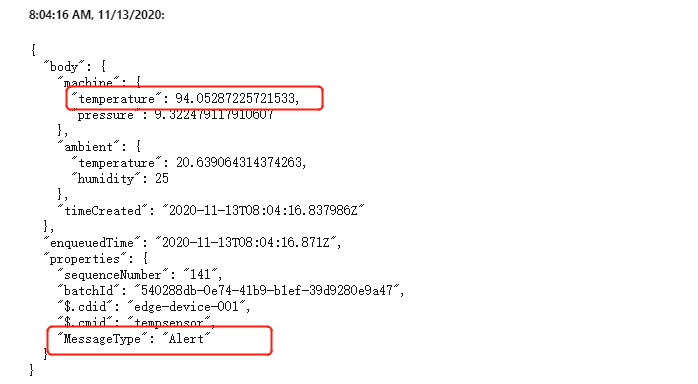

        经过对比，我们可以看到第一条消息中增加了ENCODED属性，且消息中Machine的Temperature对比原始消息，已经降低了10度。同时，因为温度高于设定的30度阈值，我们也可以看到原始消息中额外添加了Message
        Type属性，值为Alert。
