1.  登入Win10-Desktop 虚拟机，打开VSCode，使用组合键Ctrl+O打开\\IoT Hands
    On\\IoT_Hands-on_Lab\\Session 2\\Edge_yolov3_onnx 文件夹

2.  点击菜单栏，Terminal – New Terminal 打开新命令行窗口

3.  登录Azure Container Register， 如在之前教程已登录可省略

4.  运行 ```docker build -f yolov3.dockerfile . -t {your acr address}/yolov3onnx:1.0 ``` ,根据网速不同，大约需要5-10分钟完成所有操作

5.  运行docker image list查看本地镜像

    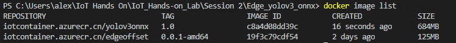

6.  运行```docker push {your acr address}/yolov3onnx:1.0```将本地镜像推送至Azure容器注册表

    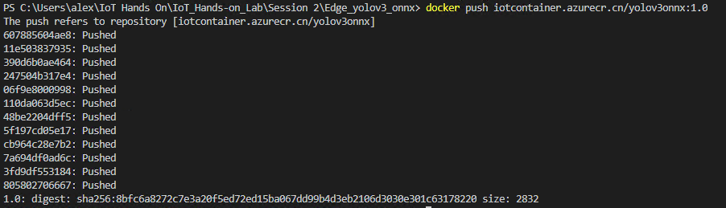

7.  推送完成后，在Azure容器注册表的对应存储库能够看到推送成功的镜像，并记录Docker镜像的地址
    {your acr address}/yolov3onnx:1.0

    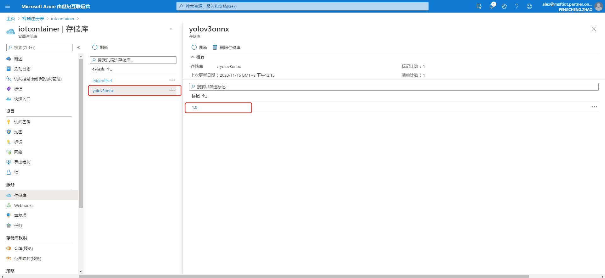

8.  将容器镜像部署至边缘设备（Edge Device）,进入IoT中心，选择IoT Edge –
    edge-device-001 – 设置模块

    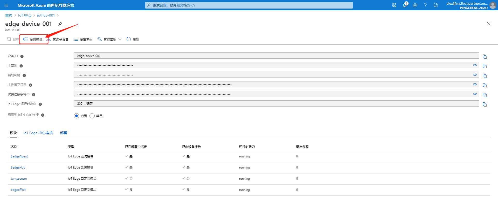

9.  选择Add-IoT Edge Module

    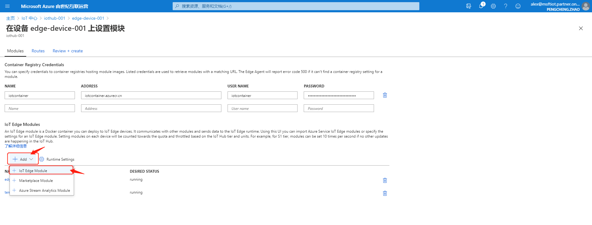

10. 配置 IoT Edge Module Name: yolov3onnx / Image URI: {your acr
    address}/yolov3onnx:1.0.

    配置 Container Create Options为：

    ```json
    {
    "HostConfig": {
        "PortBindings": {
            "80/tcp": [
                {
                "HostPort": "8080"
                }
                ]
            }
        }
    }
    ```

将程序80端口暴露为宿主机8080端口，按Add保存。

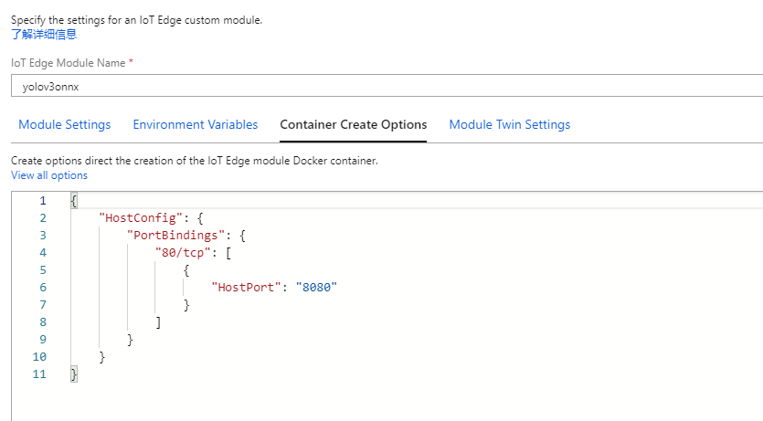

1.  开放Edge Device虚拟机防火墙8080端口。  
    

    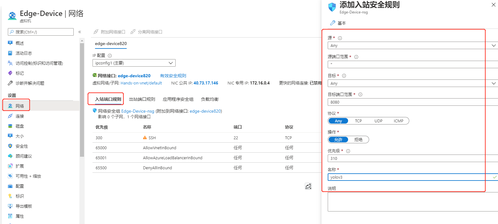

2.  登入Edge Device, 运行iotedge logs -f edgeAgent / iotedge list,
    观察log及查看是否部署成功。

    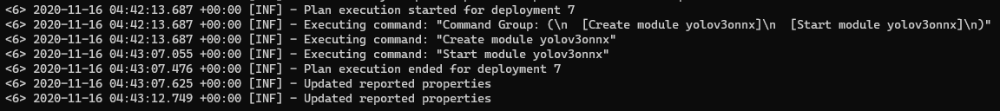

    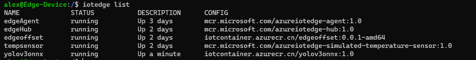

3.  使用Postman采用示例图片（\\IoT Hands On\\IoT_Hands-on_Lab\\Session
    2\\Picture_For_Test\\yolov3.jpg）测试API是否正常工作，如图。注意，由于程序限制，需要把图片事先调整为为416\*416像素，或者可以自行修改程序使用OpenCV进行对应调整。

    打开Postman，方法选择为Post，地址为Edge Device IP:8080/score

    在Body选项卡中，将格式设置为Binary，选择示例图片作为附件。

    点击Send。

    可以在返回的Json中看到识别结果。

    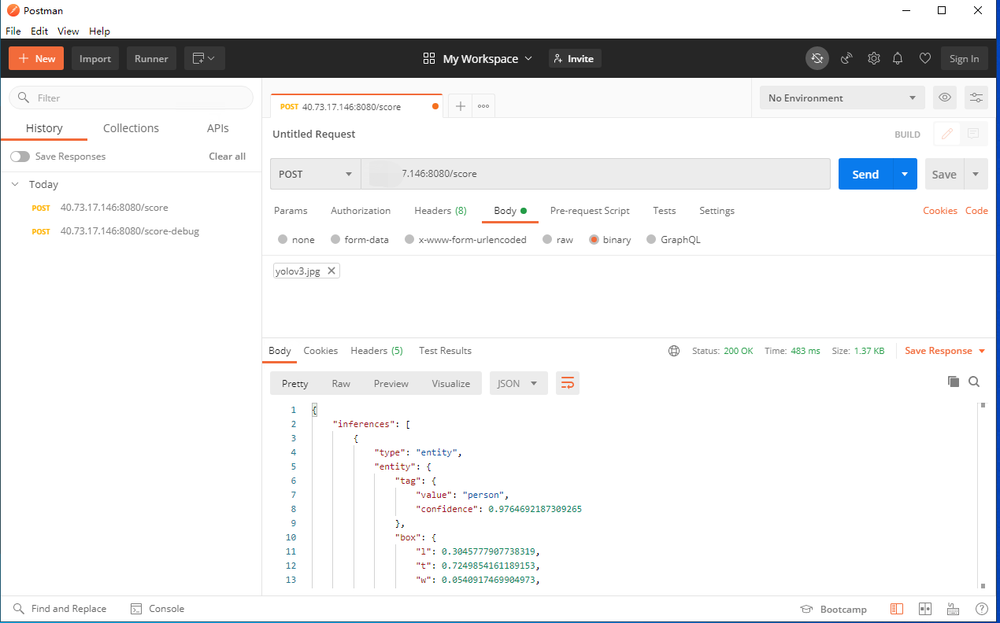

    或者，使用命令行工具，输入

    ```bash
    curl -X POST http://{Edge Device IP}:8080/annotate -H "Content-Type:
    image/jpeg" --data-binary \@\<image_file_in_jpeg\> --output out.jpeg
    ```

    在示例图片文件夹中找到 out.jpg, 如图

    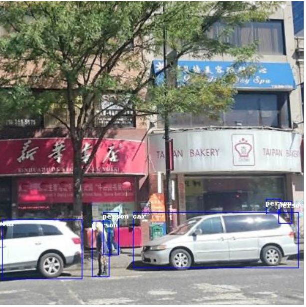

    可以看到人和车辆已经被正确识别并标注出来。

    结合微软的Live video
    analytics功能，可以依据自定义模型作为分析视频流的触发器，并结合其余手段按帧处理及分析视频。
